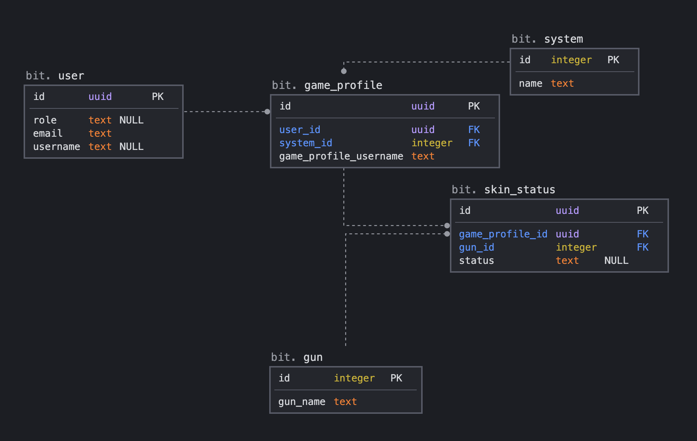
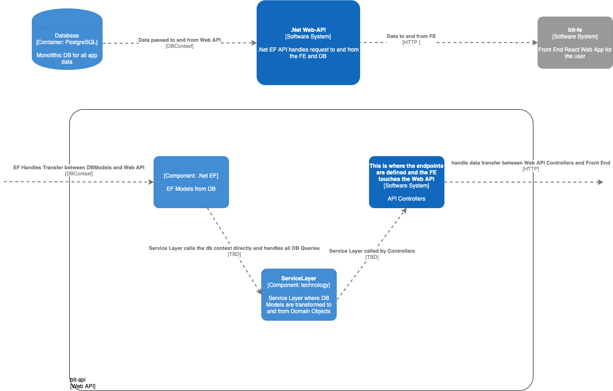

# black-ice-tracker

## Local Dev Setup 

#### Frontend Project Setup
1. Install [node.js](https://nodejs.org/en/)
2. Open bash / terminal at `/black-ice-tracker/bit-fe`
3. run `npm install`
4. run `npm start`, project should run locally at [localhost:3000](https:localhost:3000)

#### DB Setup
1. Install [postgresql](https://www.postgresql.org/download/) locally
2. Install [pgadmin](https://www.pgadmin.org/download/) locally
3. Open bash / terminal at `/black-ice-tracker/backend`
4. Run `psql -f 00-create-db.sql` 
<br> (note: if you run into error: `<user> is not a database`, <br>run `createdb <your-user-name>` [stackoverflow help](https://stackoverflow.com/questions/17633422/psql-fatal-database-user-does-not-exist)) 

#### Backend / Web API Setup
1. Install [.NET Core v 3.1](https://dotnet.microsoft.com/download) locally
2. Install [VSCode](https://code.visualstudio.com/) + [Visual Studio Solution Explorer](https://marketplace.visualstudio.com/items?itemName=fernandoescolar.vscode-solution-explorer) or your IDE of choice
3. Open `black-ice-tracker/bit-api/` in IDE or VS Code
4. In Solution: Explorer Pane, right click `bit-api` to build project
5. Click Run > Start debugging (wait for Select Environment dropdown)
6. Select ```.NET Core``` from Select Environment dropdown and then default configuration (whatever pops up on the screen)
7. Swagger for the Api should load on [localhost:5000](http://localhost:5000/index.html) If nothing happens, try step 5 + 6 again


## DB Model



``Architecture Draw.io Diagram``



To update:
- edit ```./repo-assets/architecture-diagram.drawio``` 
- save draw.io file 
- save new PNG file
- replace ```./repo-assets/images/architecture-diagram.png```

``Web API``

``` 
GET 
url - api/guns

response: 

{
    "data": [
        {
            "id": number,
            "name": string
        }
    ]
}
```

```
GET
url - api/skins/{id} <-- game profile id

response: 

{
    skins: [
        {
            "id": number,
            "status": string
        }
    ]
}
